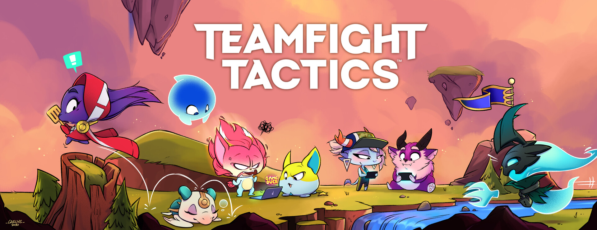

[](https://github.com/Bulletdev/TFT-Assistant/actions/workflows/codeql.yml)
<p align="center"> 
  
  
  
  <a href="https://www.linkedin.com/in/Michael-Bullet/">
    
  </a> 
  
  
  
  <a href="https://github.com/Bulletdev/TFT-Assistant/commits/master">
    
  </a>

  
</p>

  

<div>
<p align="center"> 
  
</p>

<div align="center"> <h1>TFT ASSISTANT</h1> </div>

<div>
<p align="center"> 
  
</p>

##  Descrição

- Uma ferramenta de assistência para Teamfight Tactics (TFT) desenvolvida em Java, com funcionalidades avançadas para melhorar sua performance no jogo.

### Funcionalidades Principais

> Recomendação de Composições
 
> Análise de Sinergias

> Sugestão de Itens
 
> Captura e Análise de Estado do Jogo

> Assistente de Posicionamento

> Histórico de Partidas

##  Pré-requisitos

> Java 17+

> Maven

> Tesseract OCR

> Chave de API da Riot Games

##  Configuração

### 1. Instalação de Dependências

# Instalar Tesseract OCR


# No Ubuntu/Debian

```
sudo apt-get install tesseract-ocr
```

# No macOS com Homebrew

```
brew install tesseract
```

# No Windows, baixe o instalador do site oficial

https://github.com/UB-Mannheim/tesseract/wiki


2. Configuração do Projeto

> Clone o repositório

````
git clone https://github.com/bulletdev/tft-assistant.git
````

````
cd tft-assistant
````

##  Configure a Chave da API da Riot


> Crie um arquivo config.properties na raiz do projeto

RIOT_API_KEY=sua_chave_api_aqui

https://developer.riotgames.com

## Compile e Execute


````
mvn clean package
````
# Executar a aplicação

````
mvn javafx:run
````
##  Uso

> Abra o TFT

> Inicie o TFT Assistant

> A ferramenta irá capturar e analisar automaticamente o estado do jogo

##  Contribuição

Faça um fork do projeto

- Crie uma branch para sua feature (git checkout -b feature/nova-feature)
- Commit suas mudanças (git commit -m 'Adiciona nova feature')
- Push para a branch (git push origin feature/nova-feature)
- Abra um Pull Request

##   Limitações e Avisos

- Requer permissão de captura de tela
- Precisão depende da qualidade da captura
- Respeite os Termos de Serviço da Riot Games
